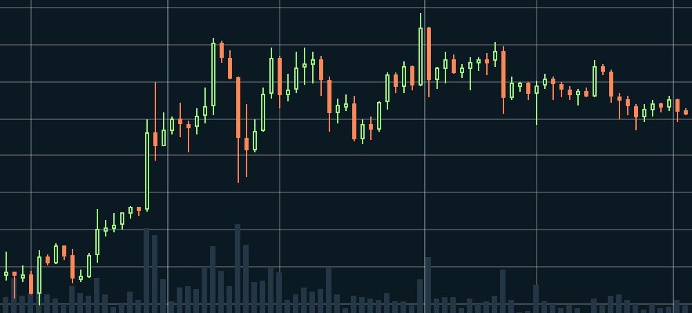

# Crypto Analytics Platform

<p align="center">
  
</p>

<p align="center">
  Real-time cryptocurrency analytics platform built with Kafka, Redis, TimescaleDB, Socket.IO, and React.
</p>

<p align="center">
  Event-Driven Microservices • Real-Time Streaming • OHLCV Aggregation • WebSocket Broadcasting
</p>

<p align="center">
  
  
  
  
  
  
</p>

---

## Overview

Crypto Analytics Platform is a distributed real-time market data pipeline designed for low-latency financial dashboards and streaming analytics systems.

The platform ingests live Binance trade streams, processes them through Kafka-based event pipelines, aggregates OHLCV candles, evaluates EWMA-smoothed alerts, and broadcasts updates to browser clients through dedicated WebSocket services.

The architecture demonstrates scalable event-driven microservice patterns using TypeScript, Redis hot caching, Kafka fan-out, and time-series persistence.

---

## Features

* Real-time Binance WebSocket ingestion
* Kafka-based event streaming architecture
* Redis hot snapshot caching
* OHLCV candle aggregation engine
* EWMA-based price spike/drop alerts
* Room-based WebSocket broadcasting
* Time-series persistence with TimescaleDB
* REST API Gateway with structured logging
* Clean Architecture service boundaries
* Graceful shutdown and reconnect handling
* Circuit breaker & backpressure protection

---

## Tech Stack

| Layer          | Technologies                                            |
| -------------- | ------------------------------------------------------- |
| Frontend       | React 19, Vite 6, Tailwind CSS, Zustand, TanStack Query |
| Backend        | Node.js, Express.js 5, Socket.IO, KafkaJS               |
| Databases      | PostgreSQL, TimescaleDB, Redis                          |
| Infrastructure | Kafka, Zookeeper, Docker Compose                        |
| Tooling        | Turborepo, pnpm, Prisma, ESLint, Prettier               |
| Resilience     | Opossum, p-queue                                        |

---

## System Flow

```text
Binance Stream
      │
      ▼
Producer Service
(Zod Validation + Queue + Circuit Breaker)
      │
      ▼
Kafka Topics (raw-ticks)
      │
 ┌────┼─────────────┐
 ▼    ▼             ▼
Market Analytics   WebSocket
Service Service    Service
 ▼       ▼             ▼
Redis  TimescaleDB  Socket.IO
      │
      ▼
 React Frontend
```

---

## Project Structure

```bash
crypto-analytics/
├── apps/
│   ├── api-gateway/
│   └── web/
├── services/
│   ├── producer-service/
│   ├── market-service/
│   ├── analytics-service/
│   └── websocket-service/
├── packages/
│   ├── contracts/
│   ├── database/
│   ├── eslint-config/
│   └── typescript-config/
├── infrastructure/
└── docs/
```

---

## Quick Start

### Prerequisites

* Node.js >= 18
* pnpm >= 9
* Docker & Docker Compose

---

### Installation

```bash
git clone <repository-url>
cd crypto-analytics

pnpm install
```

---

### Environment Setup

```bash
cp .env.example .env
```

Update environment variables as needed.

---

### Start Infrastructure

```bash
docker compose -f infrastructure/docker-compose.yml up -d
```

Services started:

| Service   | Port |
| --------- | ---- |
| Kafka     | 9092 |
| Zookeeper | 2181 |
| Redis     | 6379 |
| Kafka UI  | 8080 |

---

### Database Setup

```bash
cd packages/database

pnpm db:generate
pnpm db:push
```

---

### Start Development Environment

```bash
pnpm dev
```

---

## Local Endpoints

| Service            | URL                   |
| ------------------ | --------------------- |
| Frontend Dashboard | http://localhost:3000 |
| API Gateway        | http://localhost:4000 |
| WebSocket Service  | http://localhost:4100 |
| Kafka UI           | http://localhost:8080 |

---

## REST API

### Market Data

```http
GET /api/v1/market/tickers
GET /api/v1/market/history/:symbol
```

### Alerts

```http
GET /api/v1/alerts
```

### Health Check

```http
GET /health
```

---

## WebSocket Events

### Subscribe

```ts
socket.emit("subscribe", [
  "tickers",
  "ticker:BTCUSDT"
]);
```

### Tick Event

```ts
{
  symbol: "BTCUSDT",
  price: "64000",
  quantity: "0.42",
  timestamp: 1710000000
}
```

### Alert Event

```ts
{
  type: "PRICE_SPIKE",
  symbol: "BTCUSDT",
  changePercent: 4.8
}
```

---

## Engineering Highlights

### Event-Driven Architecture

Kafka acts as the central event bus separating ingestion, aggregation, persistence, and broadcasting into independently scalable services.

### Redis Hot Cache

Redis stores ephemeral ticker snapshots and in-progress candle state to reduce database load and provide low-latency reads.

### Backpressure Protection

The producer service uses bounded in-memory queues and circuit breakers to protect the system during upstream spikes or exchange instability.

### Clean Architecture

Each service follows Onion/Clean Architecture principles with isolated domain logic and infrastructure adapters.

### Graceful Shutdown

All services drain Kafka consumers, flush Redis buffers, disconnect Prisma, and close HTTP servers before termination.

---

## Performance Notes

| Metric                      | Result         |
| --------------------------- | -------------- |
| Tick throughput             | ~15k ticks/min |
| Redis snapshot read latency | <5ms           |
| WebSocket propagation       | ~40–80ms       |
| Aggregation interval        | 1 minute       |
| Symbols tested              | 25+            |

---

## Current Limitations

* Authentication layer not implemented
* Dockerfiles not yet added
* CI/CD pipelines not configured
* Single-region deployment only
* No automated integration testing yet

---

## Roadmap

### Phase 1

* Multi-stage Docker builds
* GitHub Actions CI/CD
* Service health monitoring

### Phase 2

* JWT authentication
* RBAC authorization
* User-defined alert thresholds

### Phase 3

* OpenTelemetry tracing
* Prometheus & Grafana metrics
* Kafka lag monitoring

### Phase 4

* Kafka partitioning by symbol
* Consumer group scaling
* Redis Adapter Socket.IO clustering

---

## Development

### Lint

```bash
pnpm lint
```

### Type Check

```bash
pnpm check-types
```

### Format

```bash
pnpm format
```

---

## Documentation

Additional documentation available in:

```text
docs/
├── architecture.md
├── scaling.md
├── deployment.md
└── contributing.md
```

---

## License

MIT License
